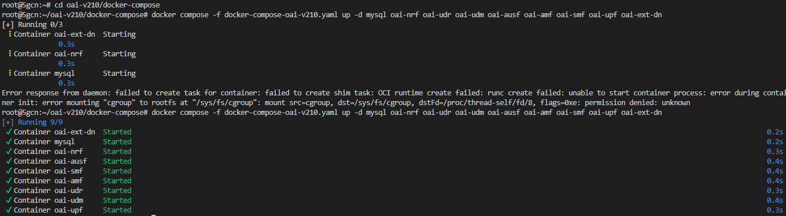

## 1. Install lxd
```bash
snap install lxd --channel=latest/stable
sudo adduser $USER lxd
newgrp lxd
```

## 2. Init a lxd profile
```bash
sudo lxd init
```
We need to answer a list of questions, default options should work.\
We can verify information by typing the following commands:
```bash
lxc profile list
lxc profile show default
lxc network list
lxc network show lxdbr0
lxc storage list
```

## 3. Adding ufw rules for the bridge
```bash
sudo ufw allow in on lxdbr0 comment 'lxdbr0 for LXD'
sudo ufw route allow in on lxdbr0 comment 'lxdbr0 for LXD'
sudo ufw route allow out on lxdbr0 comment 'lxdbr0 for LXD'
```

## 4. Ensure your user has the required privileges to use LXC. To check that, look for the following lines in the files `/etc/subuid` and `/etc/subgid`

```
lxd:100000:65536
root:100000:65536
```

- If such lines are missing, use your preferred text editor to write them (e.g., `sudo vim /etc/subuid /etc/subgid`).
- Remember to restart the LXD service after this change: `sudo systemctl restart lxd`, `sudo snap restart lxd`, or `sudo service lxd restart`.

## 5. Import the archived image in lxc:

```bash
lxc image import base-2204.tar.gz --alias base 
```

The outcome of this operation can be also confirmed with the command `lxc image list`, which should show the new image.

## 6. Initialize and launch the container:

```bash
lxc init local:base base-ubuntu
lxc start base-ubuntu

# or combine above commands with
lxc launch local:base base-ubuntu

lxc list
```

The example result:
<p align="center">
  
</p>


## 7. If no network is provided to containers:

```bash
lxc network list
lxc network attach lxdbr0 base-ubuntu eth0
lxc exec base-ubuntu -- dhclient eth0

sudo tee /etc/resolv.conf > /dev/null <<EOF
nameserver 10.70.14.1
options edns0 trust-ad
search lxd
EOF
```

Accessing to network is important because we need to install dependencies and docker images to run OAI and flexRIC.

## 8. Configure to grant the container full privileges to mount cgroups and lets Docker run correctly inside it.
```bash
lxc config set base-ubuntu security.nesting true
lxc config set base-ubuntu security.privileged true
lxc config set base-ubuntu raw.lxc "lxc.apparmor.profile=unconfined
lxc.cgroup.devices.allow=a
lxc.cap.drop="
```

## 9. To access and make any change in the running container we type the command:

```bash
lxc exec base-ubuntu /bin/bash
```

The above command launches a process (the bash command shell) inside the container `base-ubuntu`.\
This action is the equivalent of opening a terminal in a Linux OS or logging into a remote Linux server.

## 10. Install dependencies and run OAI, FlexRIC:
```bash
root@base-ubuntu:~# sudo apt update
root@base-ubuntu:~# git clone https://github.com/binhfdv/k8s-prometheus-grafana.git
root@base-ubuntu:~# cd k8s-prometheus-grafana/
root@base-ubuntu:~# bash install_docker.sh
root@base-ubuntu:~# docker ps
root@base-ubuntu:~# git clone https://github.com/binhfdv/oai-v210.git
root@base-ubuntu:~# cd oai-v210/docker-compose
root@base-ubuntu:~# sudo docker compose -f docker-compose-oai-v210.yaml up -d
```

Here, we run all 5g Core, CU/UP split, UE, FlexRIC, xApps in one container.\
If run `lxc list`, we will see different networks created in the container.
<p align="center">
  
</p>

## 11. Ready to publish and export the custom image:
```bash
lxc stop base-ubuntu
lxc publish base-ubuntu --alias oai_core_flexric
lxc image list
lxc image export oai_core_flexric oai_core_flexric
```

Now we have the custom image `oai_core_flexric.tar.gz`.\
To save storage, we should split oai_core_flexric into 3 images:
- `oai_5gcore`: containing docker images of core functions
- `oai_e2_ran`: containing RAN functions
- `oai_flexric`: containing flexRIC and xApp functions

You know how to do this :)))

## 12. Deploy OAI Core and FlexRIC in multiple servers:
```bash
lxc launch local:oai_5gcore 5gcn
lxc launch local:oai_e2_ran e2ran-1
lxc launch local:oai_e2_ran e2ran-2
lxc launch local:oai_flexric flexric
```

We need 4 containers/servers:
- `5gcn`: OAI 5G Core network,
- `e2ran-1`: ORAN BS with e2 enabled,
- `e2ran-2`: nr-UE,
- `flexric`: FlexRIC and xApps.

Notes: Check step `8` if `Error response from daemon: failed to create task for container: failed to create shim task: OCI runtime create failed: runc create failed: unable to start container process: error during container init: error mounting "cgroup" to rootfs at "/sys/fs/cgroup": mount src=cgroup, dst=/sys/fs/cgroup, dstFd=/proc/thread-self/fd/8, flags=0xe: permission denied: unknown` occurs when running docker compose inside container.

### Run 5G Core:
```bash
lxc exec 5gcn /bin/bash
root@5gcn:~# cd oai-v210/docker-compose
root@5gcn:~/oai-v210/docker-compose# docker compose -f docker-compose-oai-v210-5gcn.yaml up -d
```

Sample result:
<p align="center">
  
</p>

### Run O-RAN BS:
```bash
lxc exec e2ran-1 /bin/bash
root@e2ran-1:~# cd oai-v210/docker-compose
root@5gcn:~/oai-v210/docker-compose# docker compose -f docker-compose-oai-v210-ran.yaml up -d
```

Sample result:
<p align="center">
  
</p>

### Run nr-UE:
```bash
lxc exec e2ran-2 /bin/bash
root@e2ran-2:~# cd oai-v210/docker-compose
root@5gcn:~/oai-v210/docker-compose# docker compose up oai-ue
```

Sample result:
<p align="center">
  
</p>

### Run FlexRIC & xApps:
```bash
lxc exec flexric /bin/bash
root@flexric:~# cd oai-v210/docker-compose
root@5gcn:~/oai-v210/docker-compose# docker compose up oai-nearrt-ric oai-xapp-kpm oai-rc
```

Sample result:
<p align="center">
  
</p>


## Network route setup
### `5gcn` to `e2ran`
```bash
root@5gcn:~# echo 1 > /proc/sys/net/ipv4/ip_forward
root@5gcn:~# sysctl -w net.ipv4.ip_forward=1
root@5gcn:~# ip route add 192.168.70.64/26 via 10.70.14.183 dev eth0
root@5gcn:~# iptables -t nat -A POSTROUTING -s 192.168.70.128/26 -o eth0 -j MASQUERADE
```

This tells `5gcn` to send any traffic destined for 192.168.70.64/26 via `e2ran-1`**’s eth0 interface** (10.70.14.183).

### `e2ran` to `5gcn`
```bash
root@e2ran-1:~# echo 1 > /proc/sys/net/ipv4/ip_forward
root@e2ran-1:~# sysctl -w net.ipv4.ip_forward=1
root@e2ran-1:~# ip route add 192.168.70.128/26 via 10.70.14.179 dev eth0
root@e2ran-1:~# iptables -t nat -A POSTROUTING -s 192.168.70.64/26 -o eth0 -j MASQUERADE
```

This tells `e2ran-1` to send any traffic for the 192.168.70.128/26 via `5gcn`**’s eth0 interface** (10.70.14.179).