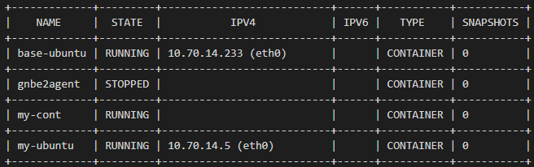
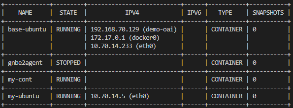

## Install lxd
```
snap install lxd --channel=latest/stable
sudo adduser $USER lxd
newgrp lxd
```

## Init a lxd profile
```
sudo lxd init
```
We need to answer a list of questions, default options should work.\
We can verify information by typing the following commands:
```
lxc profile list
lxc profile show default
lxc network list
lxc network show lxdbr0
lxc storage list
```

## Adding ufw rules for the bridge
```
sudo ufw allow in on lxdbr0 comment 'lxdbr0 for LXD'
sudo ufw route allow in on lxdbr0 comment 'lxdbr0 for LXD'
sudo ufw route allow out on lxdbr0 comment 'lxdbr0 for LXD'
```

## Configure to grant the container full privileges to mount cgroups and lets Docker run correctly inside it.
```
lxc config set base-ubuntu security.nesting true
lxc config set base-ubuntu security.privileged true
lxc config set base-ubuntu raw.lxc "lxc.apparmor.profile=unconfined
lxc.cgroup.devices.allow=a
lxc.cap.drop="
```

## Ensure your user has the required privileges to use LXC. To check that, look for the following lines in the files `/etc/subuid` and `/etc/subgid`

```
lxd:100000:65536
root:100000:65536
```

- If such lines are missing, use your preferred text editor to write them (e.g., `sudo vim /etc/subuid /etc/subgid`).
- Remember to restart the LXD service after this change: `sudo systemctl restart lxd`, `sudo snap restart lxd`, or `sudo service lxd restart`.

## Import the archived image in lxc:

```
lxc image import base-2204.tar.gz --alias base 
```

The outcome of this operation can be also confirmed with the command `lxc image list`, which should show the new image.

## Initialize and launch the container:

```
lxc init local:base base-ubuntu
lxc start base-ubuntu

# or combine above commands with
lxc launch local:base base-ubuntu

lxc list
```

The example result:
<p align="center">
  
</p>


## If no network is provided to containers:

``` 
lxc network list
lxc network attach lxdbr0 base-ubuntu eth0
lxc exec base-ubuntu -- dhclient eth0

sudo tee /etc/resolv.conf > /dev/null <<EOF
nameserver 10.70.14.1
options edns0 trust-ad
search lxd
EOF
```

Accessing to network is important because we need to install dependencies and docker images to run OAI and flexRIC.

## To access and make any change in the running container we type the command:

```bash
lxc exec base-ubuntu /bin/bash
```

The above command launches a process (the bash command shell) inside the container `base-ubuntu`.\
This action is the equivalent of opening a terminal in a Linux OS or logging into a remote Linux server.

## Install dependencies and run OAI, FlexRIC:
```
root@base-ubuntu: sudo apt update
root@base-ubuntu: git clone https://github.com/binhfdv/k8s-prometheus-grafana.git
root@base-ubuntu: cd k8s-prometheus-grafana/
root@base-ubuntu: bash install_docker.sh
root@base-ubuntu: docker ps
root@base-ubuntu: git clone https://github.com/binhfdv/oai-v210.git
root@base-ubuntu: cd oai-v210/docker-compose
root@base-ubuntu: sudo docker compose -f docker-compose-oai-v210.yaml up -d
```

Here, we run all 5g Core, CU/UP split, UE, FlexRIC, xApps in one container.\
If run `lxc list`, we will see different networks created in the container.
<p align="center">
  
</p>